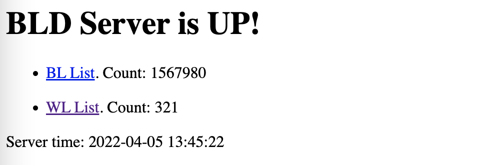
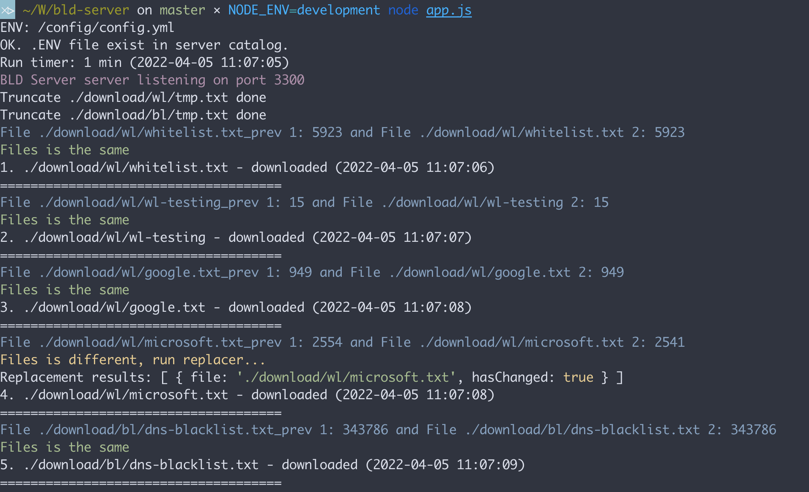

# BLD Server (Stopped)

⚠️ All functionality moved to [Cactusd Server](https://github.com/m0zgen/cactusd)

---

It is an update server for BLD DNS Servers or different DNS protection / ad-blocker servers.

You can use `config.yml` which can contains many, many blocking / allowing lists for your DNS server.

## Features

* Download lists from url
* Clean lists from comments and empty lines
* Consolidation many to one file
* Publish one file form categories (bl/wl) to world
  * BL - http://<IP>:<PORT>/bl.txt
  * WL - http://<IP>:<PORT>/wl.txt

## Parameters

Config structure:
```
default:
  server:
    port: 3300
    update_interval: 60
  download_dir:
    download
  public_dir:
    public
  lists:
    bl:
      - https://raw.githubusercontent.com/m0zgen/dns-hole/master/dns-blacklist.txt
    wl:
      - https://raw.githubusercontent.com/m0zgen/dns-hole/master/whitelist.txt
```

* Server port - listen port
* Server update interval - update lists in munutes
* Download dir - download catalog
* Public dir - web serve catalog
* BL lists - blocking lists
* WL lists - allowing (white) lists

## Install server

### As Systemd Unit

1. Install Node and NPM to your sever
2. Initiate project catalog:
```bash
cd /opt
```
3. Clone project:
```
git clone https://github.com/m0zgen/bld-server.git
```
4. `cd` to project catalog and install dependencies:
```bash
npm install 
```
5. Run server
```
node app.js 
```

### As PM2 

1. Install PM2
```bash
 npm install pm2 -g
```
2. Run project
```bash
pm2 start ecosystem.config.js --env production 
```
3. Generate startups
```bash
pm2 startup 
```
4. Save runners to startup
```bash
pm2 save 
```
5. And check app logs with `pm2 log` / `pm2 logs`
```bash
 pm2 log
```

## Run server with Environment

You can run once this server with needed environment for you:

```
NODE_ENV=development node app.js 
```

## Output

Web page:



Console log:



## Send files with cUrl

Multiple files:
```shell
curl -F file=@file1.txt -F file=@file2.log localhost:3300/upload/multiple -X POST
```

Single file:
```shell
```shell
curl -F file=@file.txt localhost:3300/upload/single -X POST
```
```

### Production config

You need to create catalog in `config\prod` and put `config.yml`.

